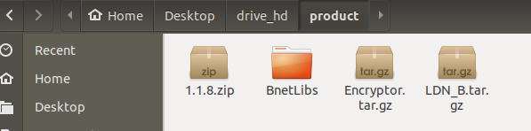
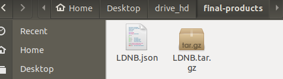
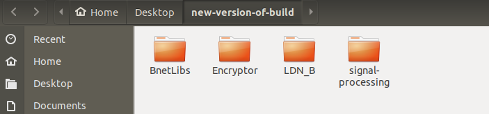
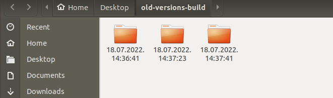
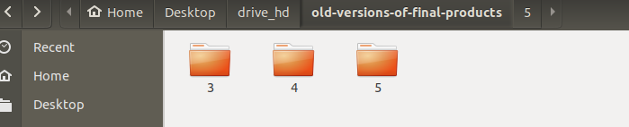
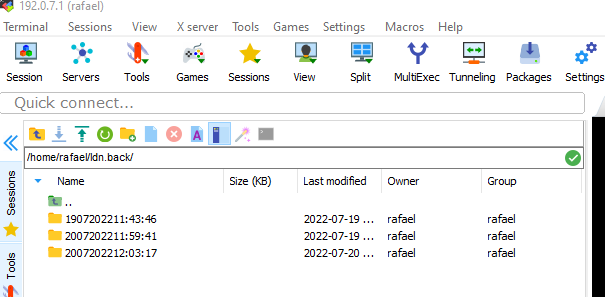

## DEPENDENCIES FOR THE SCRIPT 
- Please open VirtualBox and turn on Ubuntu machine

In the shared folder between windows pc to ubuntu machine check if there is a folder named: **product** with lowercase. 

If the folder does not exist please create it.

in that folder most have the following files with exactly the same name :
- **LDN_B.tar.gz**
- **Encryptor.tar.gz**
- The folder **BnetLibs** that contains all .so files 
- **1.1.8.zip** this doesn't have to be called 1.1.8, but must be zipped 



Go To "/home/bdk/Documents" open terminal and type: 

```
./run-all.sh
```

Open target with mobaxterm. 
In terminal: 
Cd to  "/home/rafael/moshe-scripts" and type
```
./1-move-old-versions.sh 
```

From folder "/drive_hd/final-products" in Ubuntu machine, take the files  **LDNB.json**, **LDNB.tar.gz**  

put them in target by the folder "/home/rafael/ldn/"

In the target cd to  "/home/rafael/moshe-scripts" and type in terminal:
```
./2-install.sh
```
If you want to run the "cust_wf" script:
cd to "/home/rafael/ldn" and type :
```
./cust_wf 
```

## THE CONF FILE
- In the ubuntu machine in  “/home/bdk/Documents” there is a file called “conf” in  that file you can give ia value to the  parameters  that will be injected into the script.

- In the title of the conf file you can see which fields are able to be edited. for example
  all the parameters under the title "set tx-rx.xml" will configure the xml file “tx-rx.xml”

- All parameters that are not boolean, whatever value you will give them that's what will be injected into the file.                                                                                                                                   For example if you will configure  SubWfID="50000000" , 50000000 will be the value of  SubWfID in the tx-rx.xml file, so it's your responsibility to give a proper value to each parameter.

- TxSlotsMarked=”true” willl put in comment all the sections of txSlots in the “tx-rx.xml” file.   TxSlotsMarked=”false” will not put in comment  the section txSlots in the tx-rx.xml” file. 
Same idea in the  parameter RxSlotsMarked”

- the parameter “EnableInitBypass” will insert the given value in to the “EncWrapper.xml“file

- Uncomment_libDn_WF="true" will uncomment the section   libDn_WF in  the “ModemConfigFile.xml” file and Uncomment_libDn_WF="false" will set it with a                 comment.

- All parameters have to be surrounded with quotes.
***Good  example***: 
  SubWfID=”1”

   ***Bad example***: 
   SubWfID=1

- The boolean parameters can have only the value of “true” or   “ false” in lowercase.

- Please don't  forget to save changes in the conf file. changes that will not be saved wont have effect.

## FILES AND FOLDERS

- The script extracted the files Encryptor.tar.gz, LDN_B.tar.gz, 1.1.8.zip  from "/drive_hd/product" and  puts it in "/home/bdk/Desktop/new-version-of-build/ ".
  Also all the building products will be saved in the same location.



Every time this script is executed the previous folder "/home/bdk/Desktop/new-version-of-build/ will be moved in to the folder "/home/bdk/Desktop/old-version-of-build " and the folder will get the name of the current date and time.



In "/drive_hd" there is a folder called "final-products" that contains 2 files: "LDNB.tar.gz" and "LDNB.json"  3 versions of these files will be saved in "/drive_hd/old-versions-of-final-products",if there is more than 3 versions.



every execution of this script will delete the oldest version.    

In target every execution of the script “./1-move-old-versions.sh “ will move all contents of the folder /home/rafael/ldn  to /home/rafael/ldn.back with folder name of current date and time,     3 versions of ldn will be saved.

